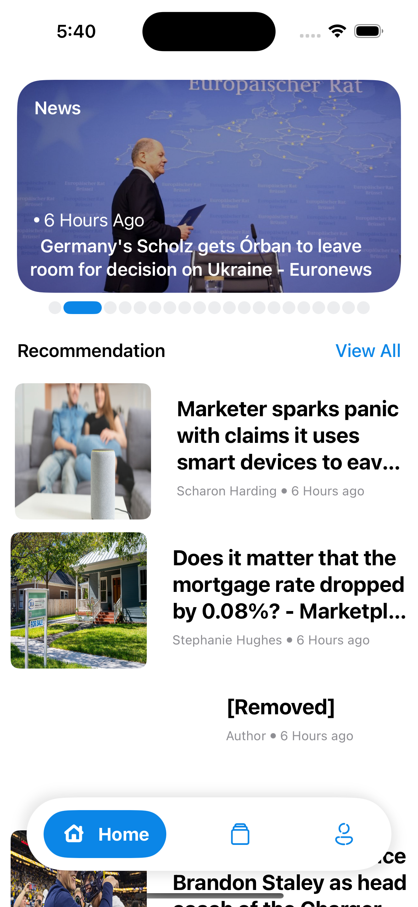
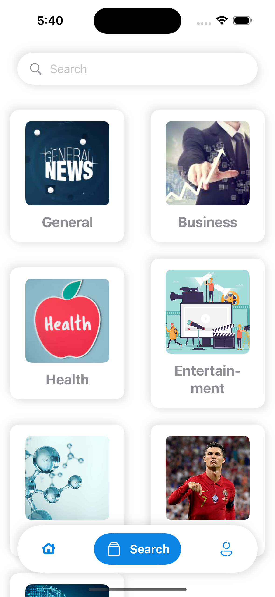
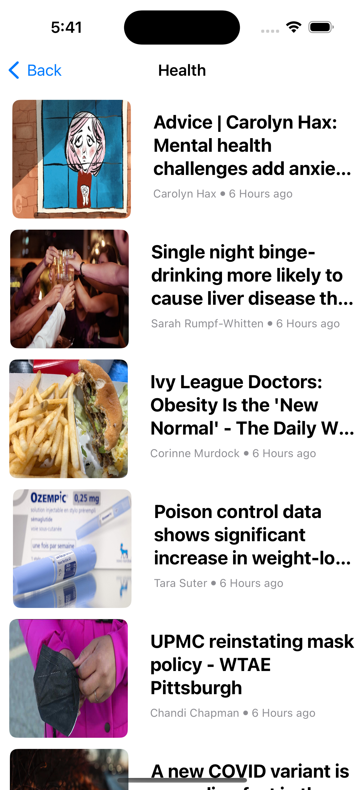
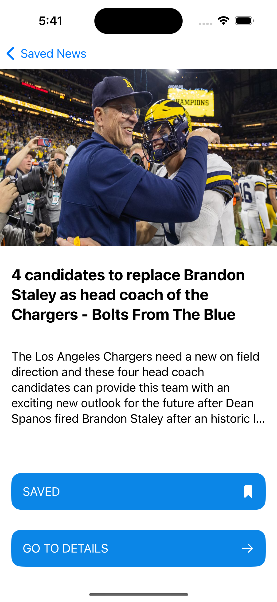
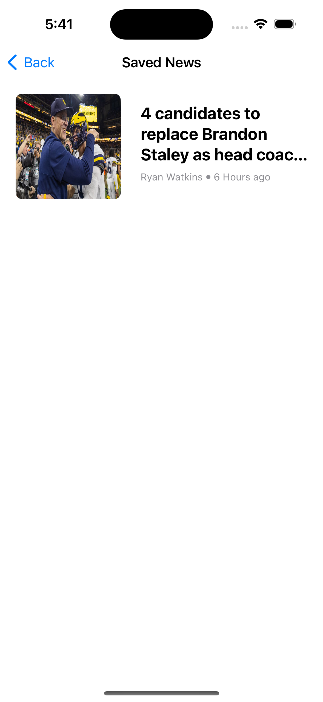

# NewsApp
News application which you can read daily news and categorize. Apps architecture is MVVM.

# TODOS
- New Network Layer
- Add Unit Tests
- Add DB(Firebase) for save news and user interests

# Feature
- SwiftUI
- MVVM
- Custom Views
- Save News With UserDefaults

# 3rd Party Libraries
- SDWebImage

# ScreenShots
 
 
 

# License
MIT
